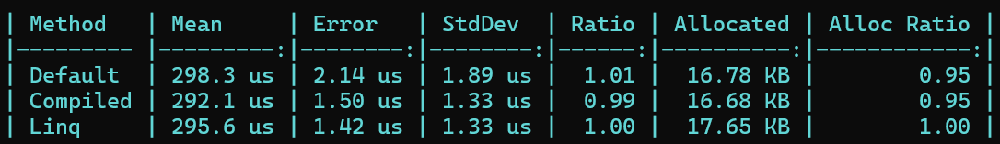
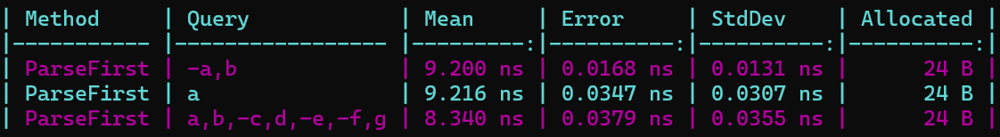

# FluentSortingDotNet

## Installation

```bash
Install-Package FluentSortingDotNet
```

## Features

- Parse sort parameters from a string in the format `name,-age`
    - A custom parser can be added by extending the `SortParameterParser` class or implementing the `ISortParameterParser` interface.
- Sort an `IQueryable<T>` based on the parsed parameters
- Handle invalid sort parameters

## Example

### Entity

```csharp
public record Person(string Name, int Age);
```

### Sorter

```csharp
using FluentSortingDotNet;

public sealed class PersonSorter(ISortParameterParser parser) : Sorter<Person>(parser) // The Sorter class also have an empty constructor that uses the DefaultSortParameterParser
{
    protected override void Configure(SortBuilder<Person> builder)
    {
        // when no parameters are provided, sort by name descending
        builder.ForParameter(p => p.Name, name: "name").Default(SortDirection.Descending);

        builder.ForParameter(p => p.Age, name: "age");
    }
}
```

### Usage

```csharp
using FluentSortingDotNet;

var sorter = new PersonSorter(DefaultSortParameterParser.Instance);

IQueryable<Person> peopleQuery = ...;

SortResult result = sorter.Sort(ref peopleQuery, "name,-age");

if (result.IsSuccess)
{
    var orderedPeople = peopleQuery.ToList();
}
else 
{
    Console.WriteLine($"Invalid sort parameters: {string.Join(", ", result.InvalidSortParameters)}");
}
```

### Dependency Injection

```csharp
services.AddSingleton<ISortParameterParser>(DefaultSortParameterParser.Instance);
services.AddSingleton<PersonSorter>();
```

## Extensibility

Extensibility will be improved hand in hand with the stability of the library. The API is currently subject to breaking changes. If you have any suggestions, please open an issue.

### Custom Sort Parameter Parser

To create a custom sort parameter parser, extend the `SortParameterParser` class or implement the `ISortParameterParser` interface.

#### Example

```csharp
using FluentSortingDotNet;
using FluentSortingDotNet.Parser;

// Parse a query in the format `name.asc,age.desc`
public sealed class CustomSortParameterParser : SortParameterParser
{
    protected override int IndexOfSeparator(ReadOnlySpan<char> query)
        => query.IndexOf(',');

    public override bool TryParseParameter(ReadOnlySpan<char> parameter, out SortParameter sortParameter)
    {
        SortDirection direction = SortDirection.Ascending;

        if (parameter.IsEmpty)
        {
            sortParameter = SortParameter.Empty;
            return false;
        }

        var directionSeperatorIndex = parameter.IndexOf('.');
        if (directionSeperatorIndex == -1)
        {
            sortParameter = SortParameter.Empty;
            return false;
        }

        var parameterName = parameter.Slice(0, directionSeperatorIndex).ToString();
        var directionName = parameter.Slice(directionSeperatorIndex + 1).ToString();

        switch (directionName)
        {
            case "asc":
                direction = SortDirection.Ascending;
                break;
            case "desc":
                direction = SortDirection.Descending;
                break;
            default:
                sortParameter = SortParameter.Empty;
                return false;
        }

        sortParameter = new SortParameter(parameterName, direction);
        return true;
    }
}
```

##### Usage
```csharp
using FluentSortingDotNet;

public sealed class PersonSorter() : Sorter<Person>(new CustomSortParameterParser())
{
    // Code omitted for brevity
}
```

### Custom Query Builder

To create a custom query builder, implement the `ISortQueryBuilder` interface along with a `ISortQueryBuilderFactory` that creates the query builder. This will rarely be needed since the default query builder is very efficient. Be default the `DefaultSortQueryBuilderFactory<T>` is used to create dynamic queries and the `ExpressionSortQueryBuilder<T>` is used to create precompiled queries for the default sort parameters.

## Performance

The library is designed to be fast and memory efficient. The area that is yet to be optimized is the reflection used to call all the `OrderBy` methods.

### Benchmarks

#### Query building

The query building is very fast. 
It has a slightly worse performance (when using a sort query string) than calling the `OrderBy`, `OrderByDescending`, `ThenBy`, and `ThenByDescending` methods directly. 
The performance is slightly better when sorting on the default sort parameters since the query is precompiled.
Both of the benchmarked query builders allocate a bit less memory since the expressions are reused.



#### Parsing

The parsing has no real-world impact on performance.

