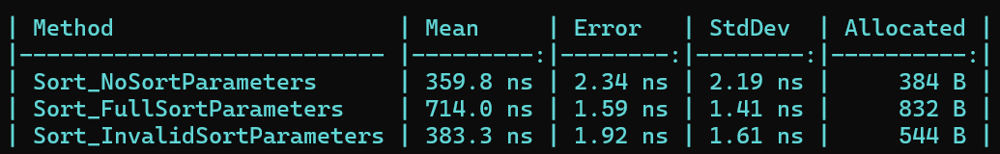

# FluentSortingDotNet

## Features

- Parse sort parameters from a string in the format `name,-age`
    - A custom parser can be added by extending the `SortParameterParser` class or implementing the `ISortParameterParser` interface.
- Sort an `IQueryable<T>` based on the parsed parameters
- Handle invalid sort parameters

## Example

### Entity

```csharp
public record Person(string Name, int Age);
```

### Sorter

```csharp
using FluentSortingDotNet;

public sealed class PersonSorter : Sorter<Person>
{
    protected override void Configure(SortBuilder<Person> builder)
    {
        // when no parameters are provided, sort by name descending
        builder.ForParameter(p => p.Name).Name("name").Default(SortDirection.Descending);

        builder.ForParameter(p => p.Age).Name("age");
    }
}
```

### Usage

```csharp
using FluentSortingDotNet;

var sorter = new PersonSorter();

IQueryable<Person> peopleQuery = ...;

SortResult result = sorter.Sort(ref peopleQuery, "name,-age");

if (result.IsSuccess)
{
    var orderedPeople = peopleQuery.ToList();
}
else 
{
    Console.WriteLine($"Invalid sort parameters: {string.Join(", ", result.InvalidSortParameters)}");
}
```

### Dependency Injection

```csharp
services.AddSingleton<ISortParameterParser, DefaultSortParameterParser>();
services.AddSingleton<PersonSorter>();
```

## Extensibility

The codebase is intentionally not very extensible. This is because the library is in a early stage and I want to see how it is used before adding more features. If you have any suggestions, please open an issue.

### Custom Sort Parameter Parser

To create a custom sort parameter parser, extend the `SortParameterParser` class or implement the `ISortParameterParser` interface.

#### Example

```csharp
using FluentSortingDotNet;
using FluentSortingDotNet.Parser;

// Parse a query in the format `name.asc,age.desc`
public sealed class CustomSortParameterParser : SortParameterParser
{
    protected override int IndexOfSeparator(ReadOnlySpan<char> query)
        => query.IndexOf(',');

    public override bool TryParseParameter(ReadOnlySpan<char> parameter, out SortParameter sortParameter)
    {
        SortDirection direction = SortDirection.Ascending;

        if (parameter.IsEmpty)
        {
            sortParameter = SortParameter.Empty;
            return false;
        }

        var directionSeperatorIndex = parameter.IndexOf('.');
        if (directionSeperatorIndex == -1)
        {
            sortParameter = SortParameter.Empty;
            return false;
        }

        var parameterName = parameter.Slice(0, directionSeperatorIndex).ToString();
        var directionName = parameter.Slice(directionSeperatorIndex + 1).ToString();

        switch (directionName)
        {
            case "asc":
                direction = SortDirection.Ascending;
                break;
            case "desc":
                direction = SortDirection.Descending;
                break;
            default:
                sortParameter = SortParameter.Empty;
                return false;
        }

        sortParameter = new SortParameter(parameterName, direction);
        return true;
    }
}
```

##### Usage
```csharp
using FluentSortingDotNet;

public sealed class PersonSorter() : Sorter<Person>(new CustomSortParameterParser())
{
    // Code omitted for brevity
}
```

## Performance

The library is designed to be fast and memory efficient. The area that is yet to be optimized is the reflection used to call all the `OrderBy` methods.

### Benchmarks

See the [benchmarks](tests/FluentSortingDotNet.Benchmarks/SorterBenchmarks.cs) for more information. Take the benchmark results with a grain of salt, as they seem to be too good to be true.

